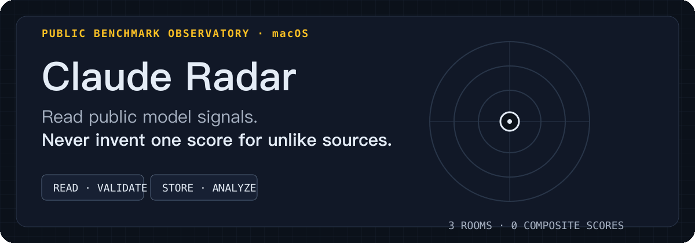
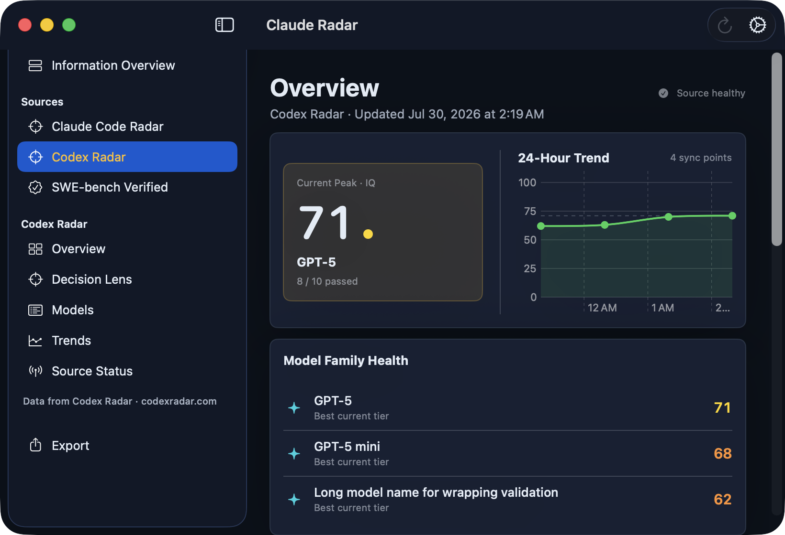

<p align="center">
  
</p>

<p align="center">
  <a href="Package.swift"></a>
  <a href="Package.swift"></a>
  <a href="https://github.com/Acfufu/Radar/releases/tag/v0.2.0"></a>
  <a href="LICENSE"></a>
</p>

<p align="center">
  English · <a href="README_zh.md">简体中文</a>
</p>

Claude Radar is a native macOS menu-bar app and workspace for reading public model-benchmark snapshots. It gives **Claude Code Radar**, **Codex Radar**, and **SWE-bench Verified** separate rooms, vocabulary, history, analysis, and export scope.

It deliberately has **no unified ranking, composite score, or cross-source recommendation**.

> [!IMPORTANT]
> Radar reads, validates, stores, analyzes, displays, and exports already-published information. It does not run benchmarks, submit results, or write to upstream systems.

## Three rooms, three contracts

<p align="center">
  
</p>

<p align="center"><sub>Native macOS workspace. Each room keeps its own metrics and provenance.</sub></p>

- **Claude Code Radar** reads benchmark, community, and source-status snapshots. Models, history, trends, derived metrics, and Pareto comparisons stay inside this room.
- **Codex Radar** reads public summaries, community snapshots, and warnings rendered on the public homepage. Official warnings and local IQ fitting remain independent; the credential-protected full API stays excluded.
- **SWE-bench Verified** reads published `mini-SWE-agent` v2 leaderboard results. `% Resolved`, 500-task counts, cost efficiency, Pareto analysis, and provenance stay source-local.

Refresh failures never replace good history with bad data. Radar keeps last valid data and labels its state; trends never bridge incompatible source revisions.

## Native workflow

1. Open workspace from menu bar and start at **Information Overview**.
2. Enter one source room to inspect models or leaderboard, history, trends, and source status.
3. Compare only compatible rows with source-local metrics and Pareto views.
4. Export selected source data as JSON ZIP, or clear normalized history and raw diagnostics separately in Settings.

## Try published snapshot

[v0.2.0](https://github.com/Acfufu/Radar/releases/tag/v0.2.0) is published snapshot `bf05ad7` for Apple silicon. The archive is ad-hoc signed for local QA, not Developer ID-signed or notarized.

```bash
curl -LO "https://github.com/Acfufu/Radar/releases/download/v0.2.0/ClaudeRadar-0.2.0-macos.zip"
curl -LO "https://github.com/Acfufu/Radar/releases/download/v0.2.0/ClaudeRadar-0.2.0-macos.zip.sha256"
shasum -a 256 -c ClaudeRadar-0.2.0-macos.zip.sha256
ditto -x -k ClaudeRadar-0.2.0-macos.zip .
open ClaudeRadar.app
```

If macOS blocks first launch, use Finder’s **Open** command and review system warning.

## Build current source

Requirements: **macOS 26+**, **Swift 6**, and Xcode at `/Applications/Xcode.app`.

```bash
git clone "https://github.com/Acfufu/Radar.git"
cd Radar
DEVELOPER_DIR="/Applications/Xcode.app/Contents/Developer" xcrun swift test
./Scripts/build-app.sh debug
RADAR_FIXTURE_MODE="ui" RADAR_DATA_ROOT="/tmp/ClaudeRadar-Demo" \
  .build/app/ClaudeRadar.app/Contents/MacOS/ClaudeRadar
```

Expected Debug fixture: native workspace opens on Information Overview with three independent source cards. Generated app: `.build/app/ClaudeRadar.app`.

Use `./Scripts/build-app.sh release` for Release build. Debug `ui` fixtures are sanitized local data and never synchronize. Release enables three documented public adapters; Debug `RADAR_FIXTURE_MODE="online"` runs them against isolated `RADAR_DATA_ROOT`. Neither mode promises network-free operation.

## Local data, explicit boundaries

```text
~/Library/Application Support/ClaudeRadar/
├── Radar.store          # normalized SwiftData history
├── SyncMetadata.json    # source-scoped synchronization metadata
└── RawSamples/          # bounded raw diagnostics
```

- Published public responses are validated before persistence.
- Normalized history, raw diagnostics, preferences, and exports stay on Mac unless you move or share them.
- Removing app does not automatically remove its data.
- Raw samples and exported ZIPs can contain upstream-provided content; review before sharing.
- Codex rendered-page reader uses nonpersistent WebKit. It retains bounded normalized warning fields, not page HTML, scripts, cookies, browser storage, response bodies, credentials, or endpoint material.
- Current source may be newer than v0.2.0 snapshot. Build source when you need current development state.

## Reference

- [Source contract](docs/source-contract.md)
- [SWE-bench integration](docs/swe-bench-integration.md)
- [Implementation status](docs/implementation-status.md)
- [Release checklist](docs/release-checklist.md)
- [Third-party notices](docs/third-party-notices.md)

## Attribution and license

Radar is not affiliated with or endorsed by Claude Code Radar, Codex Radar, SWE-bench, or Princeton University.

Copyright © 2026 Acfufu. Licensed under the [GNU General Public License v3.0](LICENSE) (`GPL-3.0-only`).
