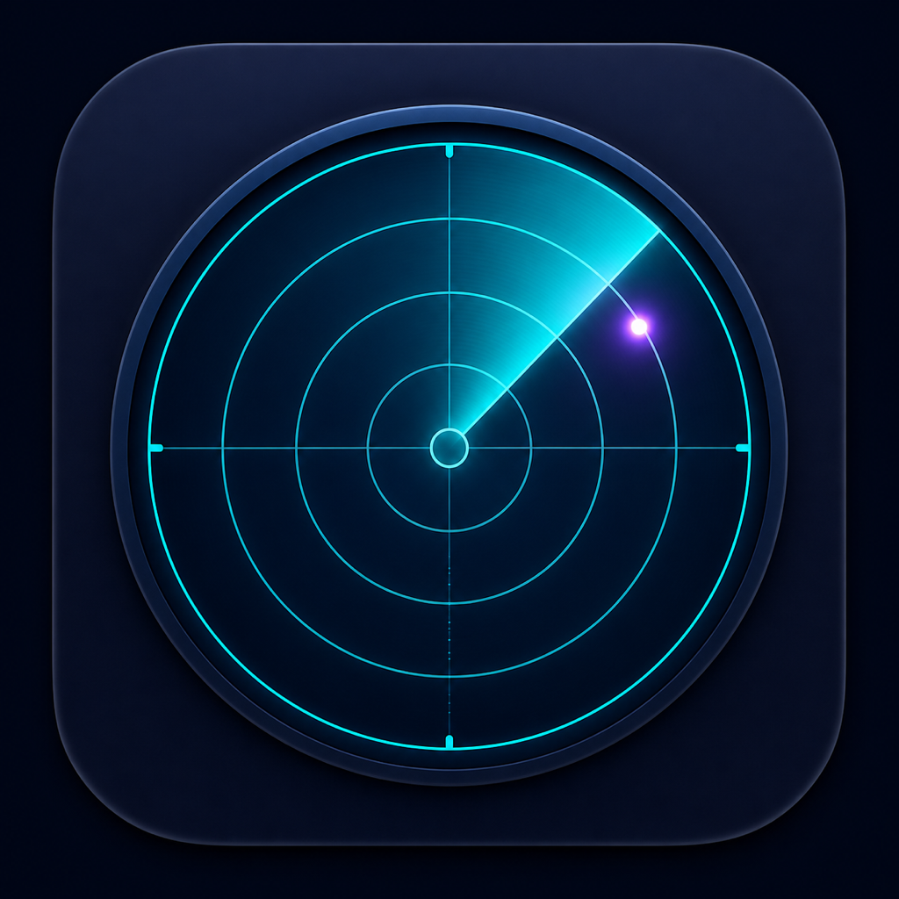

<div align="center">



# Claude Radar

**一个原生 macOS 工作台：阅读公开模型 Benchmark 快照，但不假装不同来源能共用同一套分数。**

[](Package.swift)
[](Package.swift)
[](https://github.com/Acfufu/Radar/releases/tag/v0.2.0)

简体中文 | [English](README.md)

</div>

Claude Radar 是一个菜单栏与工作区应用，包含三个彼此独立的公开来源空间：**Claude Code Radar**、**Codex Radar** 与 **SWE-bench Verified**。先在“**信息总览**”并排查看来源，再进入某个空间阅读它自己的指标语言、历史、分析与导出范围。它明确**不提供统一排名、综合分数或跨来源推荐**。

> [!IMPORTANT]
> Radar 只读取、校验、保存、分析、展示和导出已公开的信息；不运行 Benchmark、不提交结果，也不回写任何上游系统。

## 可查看的内容

| 来源空间 | 原生信息 | 分析边界 |
| --- | --- | --- |
| Claude Code Radar | Benchmark、社区与来源状态快照 | 模型、历史、趋势、派生指标与 Pareto 比较始终留在该来源内。 |
| Codex Radar | 公开摘要、社区快照与公开首页已渲染的预警值 | 官网预警与本地 IQ 拟合保持独立。受保护的完整 Codex API 被排除：Radar 不会请求、模拟、重试或绕过它。 |
| SWE-bench Verified | 已发布的 `mini-SWE-agent` v2 榜单结果 | `% Resolved`、500 题计数、成本效率、来源内 Pareto 与口径出处；Radar 不运行评测器，也不提交结果。 |

信息总览会保持这些空间彼此分离。趋势图不会跨不兼容的来源 revision 连接；刷新失败时，会保留并标记上一次有效数据，而不是用失败结果覆盖它。

## 原生工作流

1. 从菜单栏打开工作区，先进入“**信息总览**”。
2. 进入一个来源空间，查看它的模型或榜单、按来源隔离的历史与趋势，以及来源状态或 SWE-bench 方法说明。
3. 使用来源内指标与 Pareto 视图，只比较口径兼容的行。
4. 将选中来源的数据导出为 JSON ZIP，或在“设置”中分别清除规范化历史和原始诊断样本。

Radar 在本地 SwiftData store 中保存规范化来源快照，单独保留有上限的原始诊断样本，并在本地生成导出文件。默认数据根目录为：

```text
~/Library/Application Support/ClaudeRadar/
├── Radar.store          # 规范化 SwiftData 历史
├── SyncMetadata.json    # 按来源隔离的同步元数据
└── RawSamples/          # 有上限的原始诊断样本
```

删除应用不会自动删除这些数据。“设置”中的“**清除规范化历史**”与“**清除原始诊断样本**”是两个独立操作；导出前请检查内容，因为原始样本和 ZIP 可能包含上游返回的信息。

Codex 渲染页读取使用非持久 WebKit。页面自有 JavaScript 与子资源可以完成公开页面渲染，但 Radar 不会拦截或保留这些响应；只有有上限的规范化预警字段会进入历史与 `rendered-warnings` 导出。页面 HTML、脚本、Cookie、浏览器存储/资料、响应正文、凭证和端点材料都不会被保留。

## 获取已发布快照

[v0.2.0](https://github.com/Acfufu/Radar/releases/tag/v0.2.0) 是已发布的 `bf05ad7` 快照。它提供的是 ad-hoc 签名的本地 QA 压缩包，并非 Developer ID 签名或已公证的发行版。

```bash
curl -LO "https://github.com/Acfufu/Radar/releases/download/v0.2.0/ClaudeRadar-0.2.0-macos.zip"
curl -LO "https://github.com/Acfufu/Radar/releases/download/v0.2.0/ClaudeRadar-0.2.0-macos.zip.sha256"
shasum -a 256 -c ClaudeRadar-0.2.0-macos.zip.sha256
ditto -x -k ClaudeRadar-0.2.0-macos.zip .
open ClaudeRadar.app
```

如果 macOS 阻止首次启动，请在 Finder 中使用“**打开**”并阅读系统提示。当前 `dev` 开发工作比该快照更新，尚未发布，不能把它当成 v0.2.0 下载内容。

## 构建当前源码

Radar 需要 **macOS 26+**。Package 使用 Swift 6；当 Xcode 位于 `/Applications/Xcode.app` 时，仓库脚本会选用它。

```bash
git clone "https://github.com/Acfufu/Radar.git"
cd Radar
DEVELOPER_DIR="/Applications/Xcode.app/Contents/Developer" xcrun swift test
./Scripts/build-app.sh debug
RADAR_FIXTURE_MODE="ui" RADAR_DATA_ROOT="/tmp/ClaudeRadar-Demo" \
  .build/app/ClaudeRadar.app/Contents/MacOS/ClaudeRadar
```

可观察到的 Debug fixture 结果是：原生工作区打开到“信息总览”，其中有三个独立来源卡片。生成的应用位于 `.build/app/ClaudeRadar.app`。

如需运行 Release 构建，执行 `./Scripts/build-app.sh release`，再打开同一 bundle。Debug 的 `ui` fixture 使用脱敏本地数据，不会同步；Release 会启用三个已记录的公开来源 Adapter；Debug 的 `RADAR_FIXTURE_MODE="online"` 会在隔离的 `RADAR_DATA_ROOT` 中运行这些公开 Adapter。两种模式都不承诺离线或无网络行为。

## 数据流动与验证边界

- 已发布的公开响应会先校验，再保存到本地。来源身份、历史、趋势、导出、排名和分析始终按来源隔离。
- Release 只包含应用图标，不包含 fixture 或 Debug QA 资源；已批准的公开来源会在启动和设定刷新周期内同步。
- 规范化历史、原始诊断样本、偏好设置和导出档案都留在 Mac 上，除非你主动移动或分享。
- Codex Radar 的公开摘要与社区接口在范围内；需要凭证的完整 API 不在范围内。
- 当前源码与 v0.2.0 快照是不同的发布状态。请从源码构建当前开发工作，不要把归档下载当作当前版本。

来源契约和运维细节见[来源契约](docs/source-contract.md)、[发布检查表](docs/release-checklist.md)与[实现状态](docs/implementation-status.md)。

## 归属与许可证

Radar 与 Claude Code Radar、Codex Radar、SWE-bench 或 Princeton University 没有隶属或背书关系。精确的上游归属和复用边界见[第三方声明](docs/third-party-notices.md)。

仓库中没有许可证文件。除非仓库所有者明确授权，否则不授予复用或再分发本仓库的许可。
