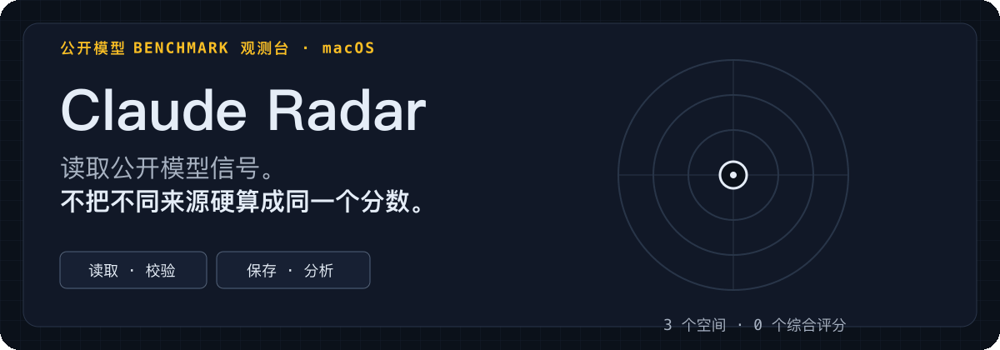
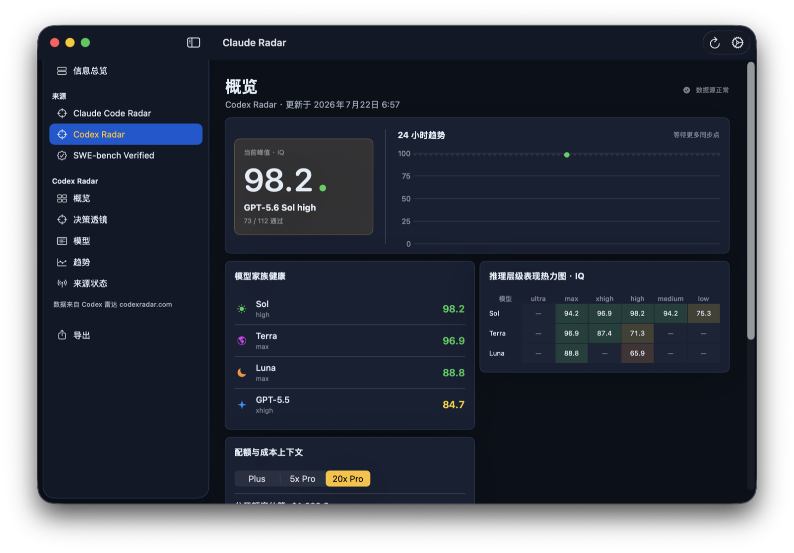

<p align="center">
  
</p>

<p align="center">
  <a href="Package.swift"></a>
  <a href="Package.swift"></a>
  <a href="https://github.com/Acfufu/Radar/releases/tag/v0.2.0"></a>
  <a href="LICENSE"></a>
</p>

<p align="center">
  <a href="README.md">English</a> · 简体中文
</p>

Claude Radar 是一个原生 macOS 菜单栏应用与工作台，用于阅读公开的模型 Benchmark 快照。它为 **Claude Code Radar**、**Codex Radar** 与 **SWE-bench Verified** 保留彼此独立的空间、指标语言、历史、分析和导出范围。

它明确**不提供统一排名、综合分数或跨来源推荐**。

> [!IMPORTANT]
> Radar 只读取、校验、保存、分析、展示和导出已公开的信息；不运行 Benchmark、不提交结果，也不回写任何上游系统。

## 三个空间，三份来源契约

<p align="center">
  
</p>

<p align="center"><sub>原生 macOS 工作台。每个空间都保留自己的指标与来源依据。</sub></p>

- **Claude Code Radar** 读取 Benchmark、社区与来源状态快照。模型、历史、趋势、派生指标和 Pareto 比较始终留在该空间内。
- **Codex Radar** 读取公开摘要、社区快照与公开首页已经渲染的预警值。官方预警与本地 IQ 拟合保持独立；需要凭证的完整 API 不在范围内。
- **SWE-bench Verified** 读取已发布的 `mini-SWE-agent` v2 榜单结果。`% Resolved`、500 题计数、成本效率、Pareto 分析与来源依据始终按来源隔离。

刷新失败不会用坏数据覆盖有效历史。Radar 会保留并标记上一次有效数据；趋势也不会跨不兼容的来源 revision 连接。

## 原生工作流

1. 从菜单栏打开工作台，先进入“**信息总览**”。
2. 进入一个来源空间，查看模型或榜单、历史、趋势与来源状态。
3. 使用来源内指标和 Pareto 视图，只比较口径兼容的数据。
4. 将选中来源导出为 JSON ZIP，或在“设置”中分别清除规范化历史与原始诊断样本。

## 试用已发布快照

[v0.2.0](https://github.com/Acfufu/Radar/releases/tag/v0.2.0) 是面向 Apple silicon 的已发布快照 `bf05ad7`。压缩包使用 ad-hoc 签名，仅供本地 QA；它没有 Developer ID 签名，也未经过 Apple 公证。

```bash
curl -LO "https://github.com/Acfufu/Radar/releases/download/v0.2.0/ClaudeRadar-0.2.0-macos.zip"
curl -LO "https://github.com/Acfufu/Radar/releases/download/v0.2.0/ClaudeRadar-0.2.0-macos.zip.sha256"
shasum -a 256 -c ClaudeRadar-0.2.0-macos.zip.sha256
ditto -x -k ClaudeRadar-0.2.0-macos.zip .
open ClaudeRadar.app
```

如果 macOS 阻止首次启动，请在 Finder 中使用“**打开**”并阅读系统提示。

## 构建当前源码

要求：**macOS 26+**、**Swift 6**，以及位于 `/Applications/Xcode.app` 的 Xcode。

```bash
git clone "https://github.com/Acfufu/Radar.git"
cd Radar
DEVELOPER_DIR="/Applications/Xcode.app/Contents/Developer" xcrun swift test
./Scripts/build-app.sh debug
RADAR_FIXTURE_MODE="ui" RADAR_DATA_ROOT="/tmp/ClaudeRadar-Demo" \
  .build/app/ClaudeRadar.app/Contents/MacOS/ClaudeRadar
```

预期的 Debug fixture：原生工作台打开到“信息总览”，其中包含三个独立来源卡片。生成的应用位于 `.build/app/ClaudeRadar.app`。

使用 `./Scripts/build-app.sh release` 可构建 Release。Debug `ui` fixture 使用脱敏本地数据且不会同步；Release 启用三个已记录的公开来源 Adapter；Debug `RADAR_FIXTURE_MODE="online"` 会在隔离的 `RADAR_DATA_ROOT` 中运行这些 Adapter。两种模式都不承诺离线或无网络运行。

## 本地数据与明确边界

```text
~/Library/Application Support/ClaudeRadar/
├── Radar.store          # 规范化 SwiftData 历史
├── SyncMetadata.json    # 按来源隔离的同步元数据
└── RawSamples/          # 有上限的原始诊断样本
```

- 已发布的公开响应会先校验，再保存到本地。
- 规范化历史、原始诊断样本、偏好设置和导出文件都留在 Mac 上，除非你主动移动或分享。
- 删除应用不会自动删除这些数据。
- 原始样本和导出的 ZIP 可能包含上游返回的内容；分享前请先检查。
- Codex 渲染页读取使用非持久 WebKit。它只保留有上限的规范化预警字段，不保留页面 HTML、脚本、Cookie、浏览器存储、响应正文、凭证或端点材料。
- 当前源码可能比 v0.2.0 快照更新；需要当前开发状态时请从源码构建。

## 参考资料

- [来源契约](docs/source-contract.md)
- [SWE-bench 集成](docs/swe-bench-integration.md)
- [实现状态](docs/implementation-status.md)
- [发布检查表](docs/release-checklist.md)
- [第三方声明](docs/third-party-notices.md)

## 归属与许可证

Radar 与 Claude Code Radar、Codex Radar、SWE-bench 或 Princeton University 没有隶属或背书关系。

Copyright © 2026 Acfufu。本项目采用 [GNU General Public License v3.0](LICENSE)（`GPL-3.0-only`）许可。
